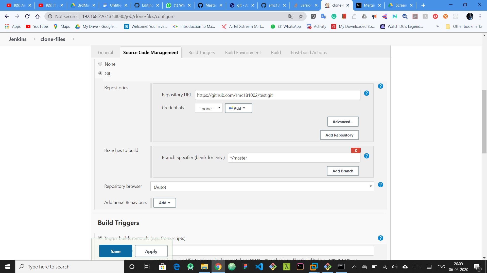
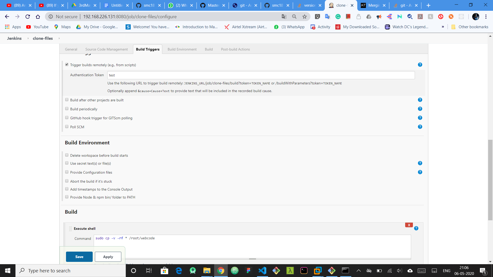
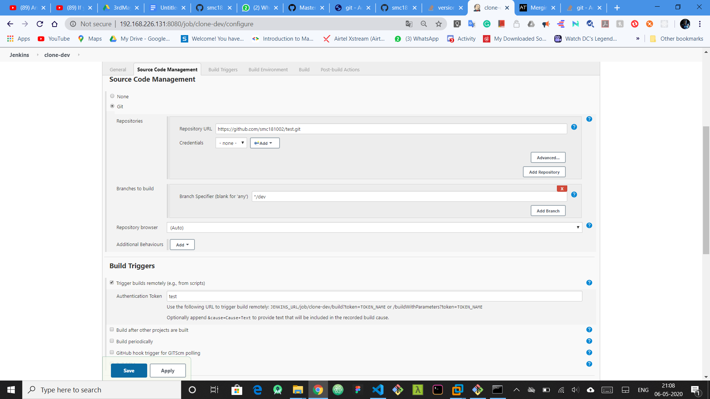
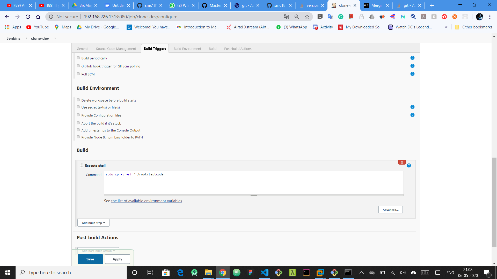
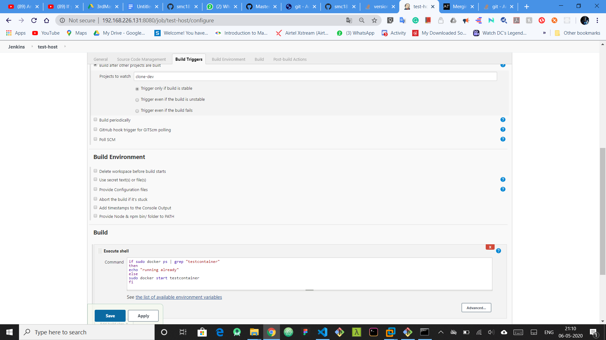
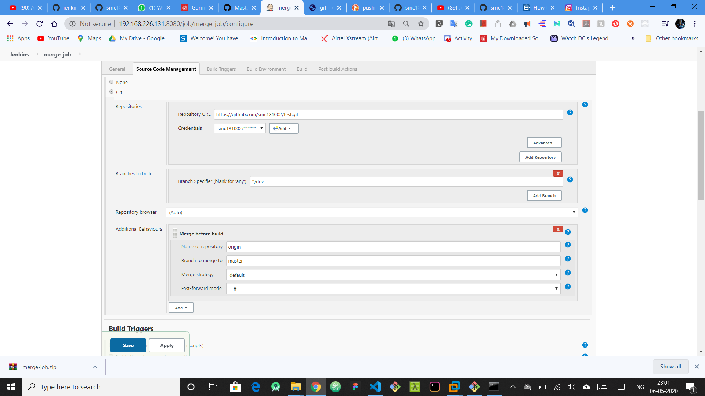
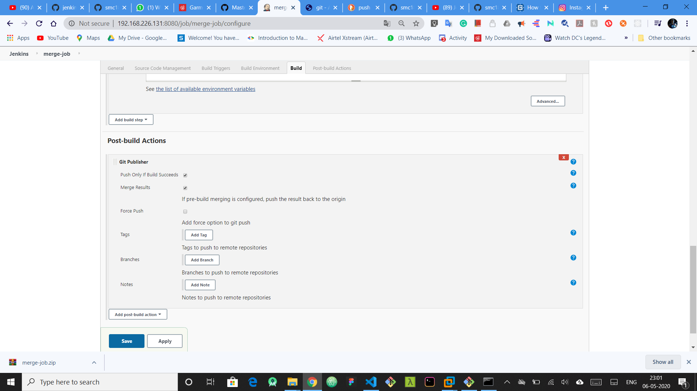

# jenkins_automation

This project is done as a task of MLOps for learning DevOps automation for learning git, jenkins and docker.

## setup
I took an example of a test repo in github. The link for the github [test code](http://github.com/smc181002/test) is here. 
for setting up the project first there are somethings to configure the linux:
* Create two directories. Enter the commands `mkdir /root/testcode` and `mkdir /root/webcode`
* The code to be tested is saved in testcode folder and the code the client uses is stored in webcode
* Though not necessary, we create a hook for pushing the code for pushing automatically using post-commit hook
* We can create a web hook with github to trigger jenkins to build the job when the code is changed in the github. for this we need to give the **public ipaddress** to github. this can be achieved by using **ngrok**. 
* We create a job for extracting the code from the github form master branch using the git plugin and then create a **remote triggers** for creating **git hooks** after post commit. we need to add a code using curl to communicate to jenkins as is a web app. 
the code for doing this is `curl --user '<admin>:<password> 'http://<IPAddress>/job/clone-files/build?token=TokenName'`


* Similarly we also create a job for extracting the developer code which is to be delpoyed in the testing server. after creating a job  similar to the above one, we also need to add this curl command  `curl --user '<admin>:<password> 'http://<IPAddress>/job/clone-dev/build?token=TokenName'` we can change the token name if we want


* Then we make two jobs: one for hosting the code from master branch to a server which a client can access and other similar job to host it in testing container. Before this we need to create the containers at the start. so the following commands should be executed first:
```sudo docker run -itd -p 8081:80 -v /root/webcode:/usr/local/apache2/htdocs/ --name mastercontainer httpd``` for client server and
```sudo docker run -itd -p 8082:80 -v /root/testcode:/usr/local/apache2/htdocs/ --name testcontainer httpd``` for testing server. Ip forwarding is done so that all everyone connected to same network as the host os can visit the webpage.


* Then we create a final job for the merging the two branches. This job is built after QA team has finalised that there is no error
* Using public ip has an advantage because after merge the code goes to github and github triggers jenkins job of pulling the code from the github to testing and also client servers



# use it
* As everything is setup, all you need to do to use the services is to paste these urls:
```<IPaddress>:8081``` for client usage
```<IPaddress>:8082``` for testing team
